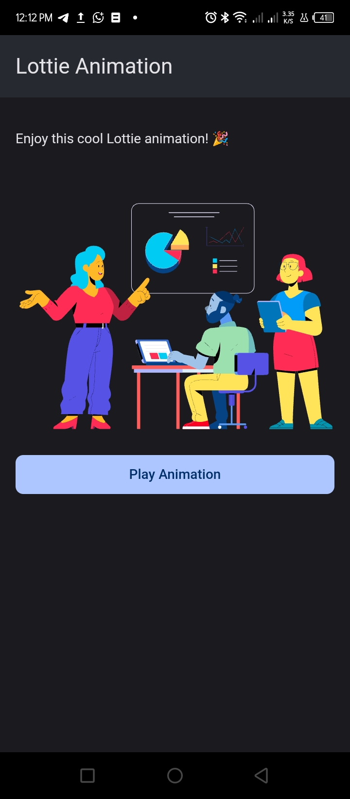

# F7Wrapper-Demos
Explore what you can build with [F7Wrapper](https://ds.justplayer.de/projects/f7wrapper) plugin through hands-on examples.

## Demos

Below are the current demo apps included in this repository, showcasing different capabilities of F7Wrapper:

---
### Dialogs

**Description:**  
Demonstrates various Framework7 dialogs.

**Screenshot:**  

---

### Lottie

**Description:**  
Integrates Lottie animations.

**Screenshot:**  

---

### MyNotes

**Description:**  
A simple note-taking app.

**Screenshot:**  

---

### QRCode Scanner

**Description:**  
Scans QR codes using device camera.

**Screenshot:**  

---

### Sound Meter

**Description:**  
Measures ambient sound levels using your device microphone.

**Screenshot:**  

---

### Swipable Tabs

**Description:**  
Showcases swipeable tab navigation using Framework7 components.

**Screenshot:**  

