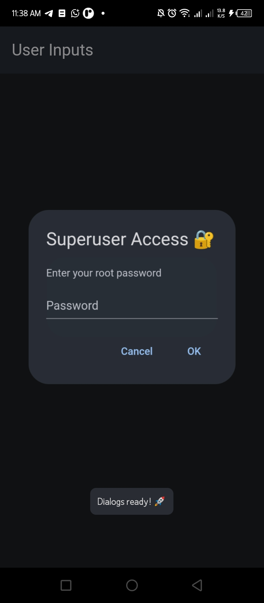
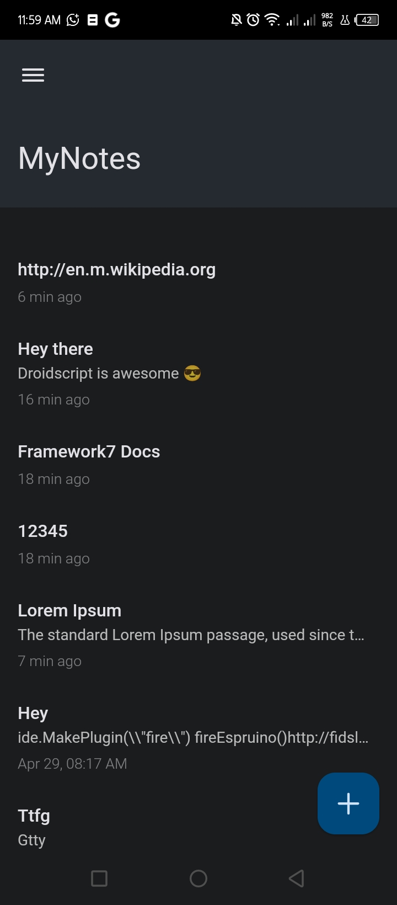
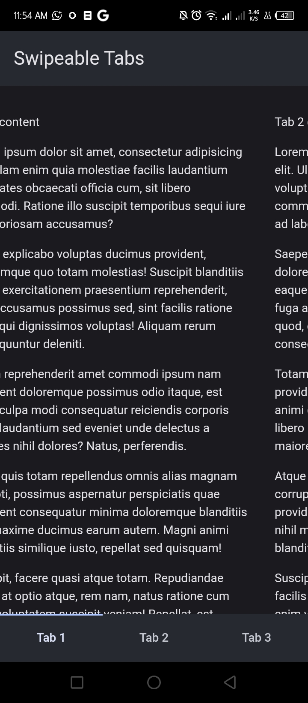

# F7Wrapper-Demos
Explore what you can build with [F7Wrapper](https://ds.justplayer.de/projects/f7wrapper) plugin through hands-on examples.

## Screenshots

|  |  |  |  |
|------------------------------------|-----------------------------------|-------------------------------------|-----------------------------------------------|
|  |  |  |                                               |

## Demos

Here's a brief overview of the available demos:

*   **Dialogs:** Showcases various dialog types available in Framework7.
*   **Lottie:** Demonstrates integration of Lottie animations.
*   **MyNotes:** A simple note-taking application.
*   **QR Scanner:** Implements a QR code scanning functionality.
*   **Sound Meter:** A basic application to measure sound levels.
*   **Swipable Tabs:** Shows how to implement swipeable tabs.
*   **TodoList:** A simple Todo List application demonstrating F7Wrapper basics, data storage, and dynamic list management.
